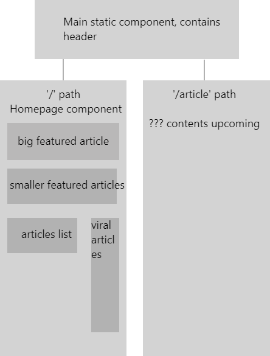

# recreation of my reproduction of cracked.com, using react instead of angular.

## planning

* recreate the components I created for the angular project with react and jsx
* make them work in a similar manner to how they worked with angular


## planning chart of component structure


## notes

* encountered a lot of trouble while deciding which project to re do in React, due to the fact that my taproom project did not have routing, ended up settling upon my recreation of cracked.com because it seemed to fulfill the requirements a little better.
* encountered quite a few problems with making the conditional in the .map loop work properly, eventually discovered it was just a missing curly brace and return statement.
* having trouble deciding where to use routing, I think I'm going to include it for making an article page.
* had some trouble with a series of errors causing the page to compile but display nothing, eventually just hunted down some naming inconsistancies that were causing it.


## installation
```
git clone https://github.com/CGosser/friday-10.git
cd friday-10
npm install
npm run start
```
